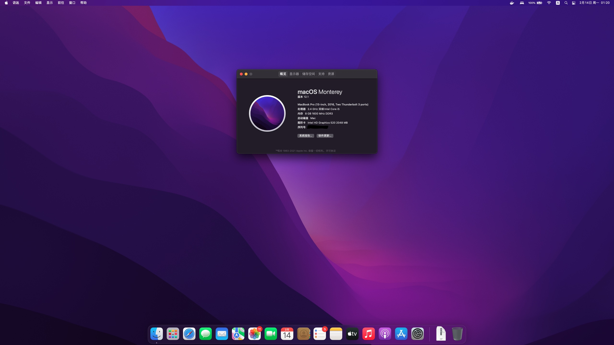

# Acer-K50-10-525V-Hackintosh-Monterey

🍎 Acer K50-10-525V Hackintosh Configuration for macOS Monterey 12.x (use OpenCore)

## Summary

This is a repo containing the files for **OpenCore** used to make most things working on the Acer K50-10-525V.

The specifications of K50-10-525V are following:

* CPU: Intel Core i5-6200U (GPU: Intel HD Graphics 520)
* RAM: 8G DDR3L 1600MHz
* Hard disk: WD 1TB HDD & Sandisk 240GB SSD (I used the SSD to install macOS.)
* Graphics card: Nvidia GeForce 940M 2G
* Sound card: Realtek High Definition Audio
* Network: Realrek RTL8168/8111/8112 Gigabit Ethernet Controller
* Wireless & Bluetooth: Atheros Qualcomm Atheros QCA9377 (I replaced it with Broadcom DW1560/BCM94532Z.)
* Display: 15.6" 1080P built-in display
* Camare: 720P Camare
* Interfaces: USB 3.0, USB 2.0, SD card reader, HDMI, VGA, Headphone jack

It seems that everything works well on macOS Monterey.

And I didn't check the SD card reader because I don't have any SD cards to test.

## How To Use

1. Download a macOS installation mirror with OpenCore from Internet, and then transfer to a USB drive.
2. Clone this repo to the local.
3. Mount the EFI partition of the USB drive, and then replace the EFI folder on the EFI partition with the EFI folder which in the repo you downloaded at the previos step.
4. Reboot your computer and boot from your USB drive and install macOS by following the installation guide. (At this step, you may reboot your computer for several times)
5. Wait for completion of the installation, enter the macOS, set up your system and then enjoy your Hackintosh!

## Notes

The built-in wireless & bluetooth adapter of my laptop is Atheros Qualcomm Atheros QCA9377, but it didn't work. So I replaced it with Broadcom BCM94532Z which works prefect and supports Airdrop and Handoff.

## Screenshot

## References

* [【黑果小兵】【微信首发】macOS Monterey 12.1 21C52 Installer for OpenCore 0.7.6 and CLOVER 5143 and WEPE 三 EFI 分区原版镜像 | 黑果小兵的部落阁](https://blog.daliansky.net/macOS-Monterey-12.1-21C52-Release-version-with-OC-0.7.6-CLOVER-5143-and-FirPE-original-image.html)
* [OpenCore Install Guide](https://dortania.github.io/OpenCore-Install-Guide/)
